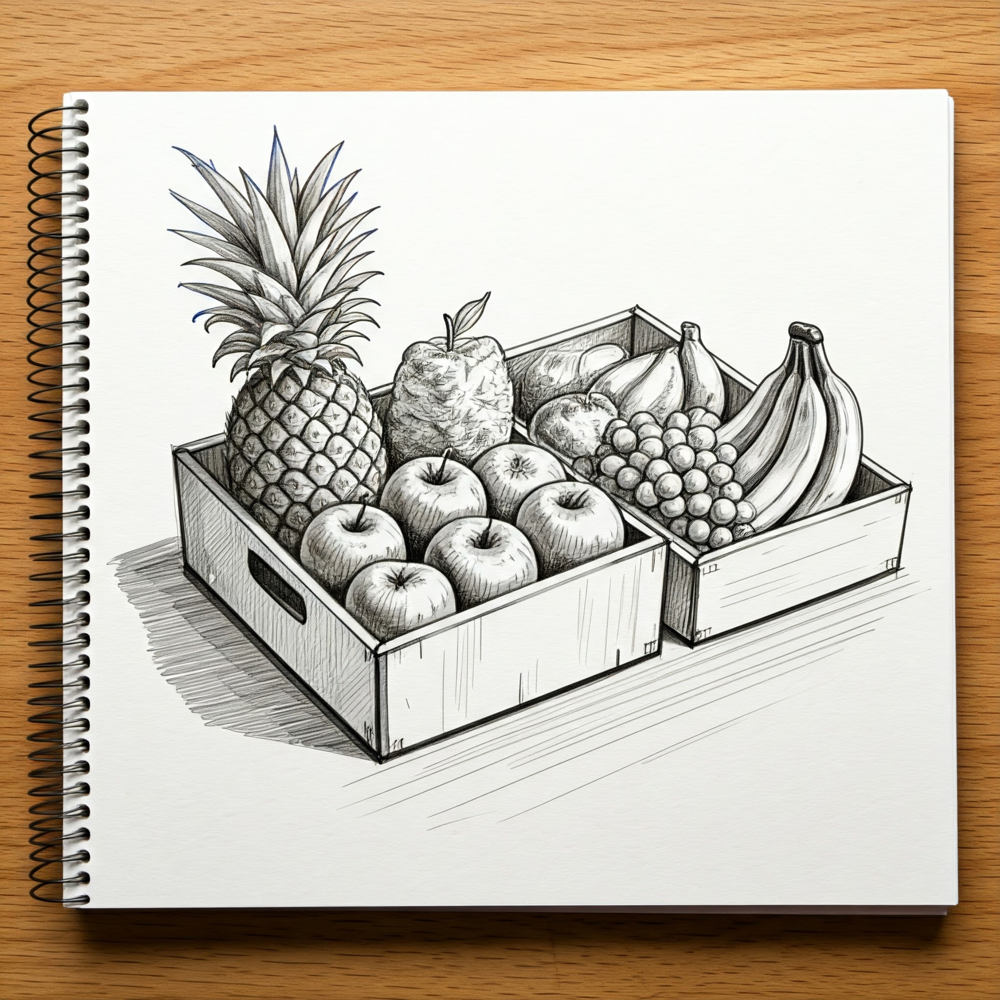
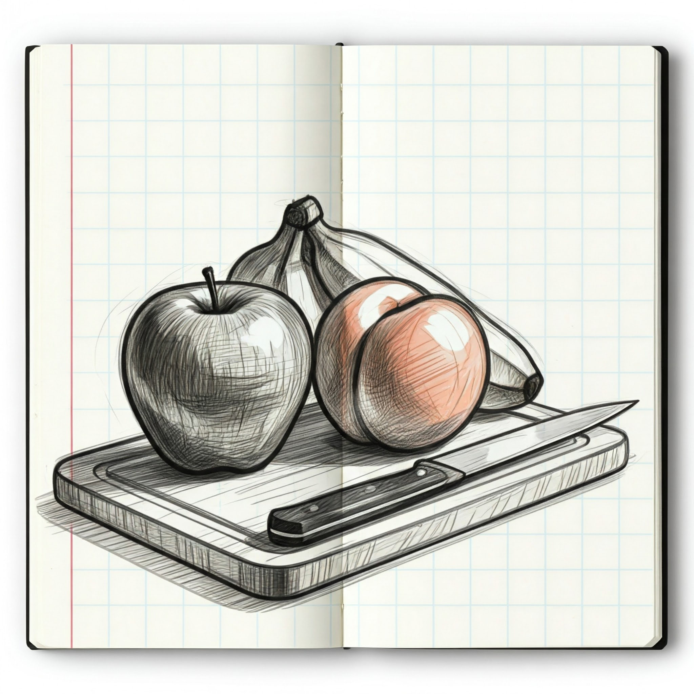

# Aplicaciones web con Python

## Estructuras de datos: **Colecciones**

### 2005 - Instituto Tecnológico de Mexicali




---
<!--
paginate: true
header: Aplicaciones web con Python
footer: Instituto Tecnológico de Mexicali
-->

# Estructuras de datos: Colecciones

> Las colecciones son objetos que agrupan datos, permitiendo organizarlos y manipularlos eficientemente. Además, son *iterables*, es decir, que se pueden recorrer con un bucle `for`.
> 

- Propósito general: `list`, `tuple`, `set`, `dict`
- Propósito específico: `named_tuple()`, `deque`, `ChainMap`, `Counter`, `OrderedDict`, `UserDict`, `UserList`, `UserString`.


---

# Estructuras de datos, colecciones: Conjuntos (`set`)

> Un conjunto(`set`) es una secuencia ***inmutable*** de objetos ***únicos*** cuyo orden no está garantizado.




---

# Operaciones con conjuntos

<div class="columnas">
<div class="col">

- Los conjuntos no son ***secuencias***.
  - No tienen orden garantizado
  - No hay acceso a sus elementos mediante índices
  - No hay elementos duplicados
  - No hay rebanadas (*slicing*)

</div>
<div class="col">

- Operaciones soportadas más comunes:
  - pertenencia/no pertenencia al conjunto
  - subconjunto/superconjunto
  - Union
  - Intersección
  - diferencia
  - Son ***iterables***

</div>
</div>

---

# Creacion de conjuntos vacíos

- Los conjuntos vacíos se pueden crear con la función `set()`
  ```python
  >>> frutas = set()
  >>> frutas
  {}

  >>> type(frutas)
  <class 'set'>
  ```

---

# Creacion de conjuntos con valores

Un conjunto con al menos un elemento puede crearse con `set()` o con `{}`:

```python
>>> frutas1 = set(["pera",])
>>> type(frutas1)
<class 'set'>

>>> frutas2 = {"pera",}
>>> type(frutas2)
<class 'set'>
```

> **Nota**: Si se intenta crear un conjunto vacío con `{}` se creará un diccionario, no un conjunto.


---

# Los conjuntos eliminan duplicados automaticamente

Ya que los conjuntos no pueden tener elementos duplicados, estos son útiles para eliminar elementos duplicados de una lista.

```python
>>> frutas = ['manzana', 'naranja', 'manzana', 'pera', 'naranja', 'banana']
>>> set(frutas)
{'manzana', 'naranja', 'pera', 'banana'}
```

---

# Pertenencia/no pertenencia de conjuntos

```python
>>> frutas
{'manzana', 'naranja', 'pera', 'banana'}
```

<div class="columnas">
<div class="col">

- Pertenencia: ¿Tenemos uvas?

  ```python
  >>> 'uvas' in frutas
  False
  ```

</div>
<div class="col">

- No pertenencia: ¿No tenemos durazno, correcto?
  ```python
  >>> # 
  >>> 'durazno' not in frutas
  False
  ```

</div>
</div>


---

# Subconjuntos

```python
>>> frutas = {'manzana', 'naranja', 'pera', 'banana'}
>>> frutas_tropicales = {'mango', 'piña', 'banana', 'maracuyá'}
```


## ¿ `frutas` es un subconjunto de `frutas_tropicales` ?

Usando el método `issubset` o el operador `<=`

```python
>>> frutas.issubset(frutas_tropicales)
False

>>> frutas <= frutas_tropicales
False
```

---

# Subconjuntos

```python
>>> frutas = {'manzana', 'naranja', 'pera', 'banana'}
>>> frutas_completas = {'manzana', 'naranja', 'banana', 'pera', 'uva', 'fresa', 'mango'}

```

## ¿ `frutas` es unsubconjunto de `frutas_completas` ?

Usando el método `issubset` o el operador `<=`

```python
>>> frutas.issubset(frutas_completas)
True

>>> frutas <= frutas_completas
True
```

---

# Superconjuntos

```python
>>> frutas = {'manzana', 'naranja', 'pera', 'banana'}
>>> frutas_completas = {'manzana', 'naranja', 'banana', 'pera', 'uva', 'fresa', 'mango'}

```

## ¿ `frutas_completas` es un superconjunto de `frutas` ?

Usando el método `issuperset` o el operador `>=`


```python
>>> frutas_completas.issuperset(frutas)
True

>>> frutas_completas > frutas
True
```

---

# Superconjuntos

```python
>>> frutas = {'manzana', 'naranja', 'pera', 'banana'}
>>> frutas_tropicales = {'mango', 'piña', 'banana', 'maracuyá'}
```

## ¿ `frutas_tropicales` es un superconjunto de `frutas` ?

Usando el método `issuperset` o el operador `>=`

```python
>>> frutas_tropicales.issuperset(frutas)
False

>>> frutas_tropicales >= frutas
False
```

---

# Superconjuntos

```python
>>> frutas = {'manzana', 'naranja', 'pera', 'banana'}
>>> frutas_tropicales = {'mango', 'piña', 'banana', 'maracuyá'}
```

## ¿ `frutas` es un superconjunto de si mismo ?

```python
>>> frutas.issuperset(frutas)
True
```

---

# Union

```python
frutas = {'manzana', 'naranja', 'pera', 'banana'}
frutas_tropicales = {'mango', 'piña', 'banana', 'maracuyá'}
frutas_completas = {'manzana', 'naranja', 'banana', 'pera', 'uva', 'fresa', 'mango'}
```

## Unión de `frutas` y `frutas_tropicales`

Usando el método `union()` o el operador `|`

```python
>>> frutas.union(frutas_tropicales)
{'manzana', 'naranja', 'piña', 'banana', 'mango', 'pera', 'maracuyá'}

>>> frutas | frutas_tropicales
{'manzana', 'naranja', 'piña', 'banana', 'mango', 'pera', 'maracuyá'}
```

---

# Union

```python
frutas = {'manzana', 'naranja', 'pera', 'banana'}
frutas_tropicales = {'mango', 'piña', 'banana', 'maracuyá'}
frutas_completas = {'manzana', 'naranja', 'banana', 'pera', 'uva', 'fresa', 'mango'}
```

## Unión de multiples conjuntos

```python
>>> frutas | frutas_tropicales | frutas_completas
{'manzana', 'naranja', 'piña', 'uva', 'fresa', 'mango', 'banana', 'pera', 'maracuyá'}
```

---

# Union

```python
frutas = {'manzana', 'naranja', 'pera', 'banana'}
frutas_tropicales = {'mango', 'piña', 'banana', 'maracuyá'}
frutas_completas = {'manzana', 'naranja', 'banana', 'pera', 'uva', 'fresa', 'mango'}
```

## Unión de un conjunto consigo mismo

```python
>>> frutas | frutas == frutas
True
```

# Union con un conjunto vacío

```python
>>> frutas | set() == frutas
True
```

---

# Estructuras de datos, colecciones: Diccionarios (`dict`)

> Colección ***mutable*** de pares llave-valor. Las llaves deben ser únicas e inmutables, mientras que los valores pueden ser de cualquier tipo. Permiten acceso rápido [*O(1)*] a los valores mediante sus llaves.


---

# Características generales

- Otros nombres: Hashmaps, memoria asociativa, arreglos asociativos
- Es un mapa de un valor ***hashable*** (**key**) a un objeto (**value**).
  - Llave (key): Cualquier objeto o valor **inmutable**: números, texto. No: `list`, `dict`
  - Valor (value): Cualquier objeto.
- A partir de Python 3.7, el orden de las llaves esta garantizado en el orden de inserción.

---

#  Operaciones soportadas más comunes:

  - Pertenencia/No pertenencia al conjunto **de llaves**.
  - Acceso/inserción y borrado de pares llave/valor.
  - Iteración sobre llaves y valores
  - Union/Concatenación
  - Intersección
  - diferencia

---

# Creación de diccionarios vacíos

Mediante la funcion `dict()` o `{}`

```python
>>> dict()
{}

>>> {}
{}
```

---

# Creación de diccionarios no vacíos con `dict()`

<div class="columnas">
<div class="col">

- Pasando las llaves y valores como parámetros de `dict()`

  ```python
  >>> dict(manzana=1.50, banana=0.75, naranja=0.90)
  {'manzana': 1.5, 'banana': 0.75, 'naranja': 0.9}
  ```

</div>
<div class="col">

- Pasando una lista de tuplas `(llave, valor)` a `dict()`
  ```python
  >>> dict([('manzana', 'roja'), ('banana', 'amarilla'), ('uva', 'morada')])
  {'manzana': 'roja', 'banana': 'amarilla', 'uva': 'morada'}
  ```

</div>
</div>

---

# Creación de diccionarios no vacíos con `{}`

```python
frutas =  {'manzana': 'roja', 'banana': 'amarilla', 'uva': 'morada'}
```

---

# Creación de diccionarios con llaves repetidas

Se queda con el ultimo valor asignado a la llave

```python
>>> dict([('manzana', 'roja'), ('banana', 'amarilla'), ('manzana', 'verde')])
{'manzana': 'verde', 'banana': 'amarilla'}
```

---

# Las llaves pueden ser cualquier objeto inmutable

```python
>>> {'foo': 'bar', 777: 'A sus ordenes jefe', 3.1416: 'pi', (1,2): 'coordenadas'}

{'foo': 'bar', 777: 'A sus ordenes jefe', 3.1416: 'pi', (1, 2): 'coordenadas'}
```

## Pero no objetos mutables

```python
>>> {(1,2): 'coordenadas'}
{(1,2): 'coordenadas'}

>>> {[1,2]: 'coordenadas'}
Traceback (most recent call last):
  File "<python-input-55>", line 1, in <module>
    {[1,2]: 'coordenadas'}
TypeError: unhashable type: 'list'
```

---

# Pertenencia y no pertenencia

```python
frutas_precios = {'manzana': 1.50, 'banana': 0.75, 'naranja': 0.90, 'uva': 2.00}
```

<div class="columnas">
<div class="col">

- Pertenencia:
  ```python
  print('manzana' in frutas_precios)   # True
  print('tuna'    in frutas_precios)   # False
  print(3.1416    in frutas_precios)   # False
  ```

</div>
<div class="col">

- No pertenencia:
  ```python
  print('manzana' not in frutas_precios)   # False
  print('sandia'  not in frutas_precios)   # True
  print(3.1416    not in frutas_precios)   # True
  ```

</div>
</div>

---

# **Asignación directa** con corchetes

La forma más común

```python
frutas_origen = {}
frutas_origen['manzana'] = 'Chile'
frutas_origen['banana'] = 'Ecuador'
frutas_origen['naranja'] = 'España'
```

---

# Método `update()`
Muy útil para agregar múltiples elementos a la vez o fusionar diccionarios.

- *Duplica* `'naranja'` con valor `'España'` (duplicado)
- Agrega `'uva'` con valor `'Perú'`
- Cambia `'manzana'`, ahora tiene valor `` 

```python
>>> frutas_origen.update({'naranja': 'España', 'uva': 'Perú', 'manzana': 'Mexico' })
>>> frutas_origen
{'manzana': 'Mexico', 'banana': 'Ecuador', 'naranja': 'España', 'uva': 'Perú'}
```

---

# Método `setdefault()`

Agrega un elemento, pero si la llave no existe, se define un valor por defecto.

```python
>>> frutas_origen.setdefault('banana', 'Colombia')
'Ecuador'

>>> frutas_origen
{'manzana': 'Mexico', 'banana': 'Ecuador', 'naranja': 'España', 'uva': 'Perú'}

>>> frutas_origen.setdefault('tomate', 'Canada')
'Canada'

>>> frutas_origen
{'manzana': 'Mexico', 'banana': 'Ecuador', 'naranja': 'España', 'uva': 'Perú', 'tomate': 'Canada'}
```

---

# Eliminación de valores

```python
frutas_origen = {'manzana': 'Chile', 'banana': 'Ecuador', 'naranja': 'España', 'uva': 'Perú'}
```

<div class="columnas">
<div class="col">

## Usando `del`

Elimina/destruye el elemento con la llave especificada.

```python
>>> del frutas_origen['naranja']
>>> frutas_origen
{'manzana': 'Mexico', 'banana': 'Ecuador', 'uva': 'Perú', 'tomate': 'Canada'}
```

</div>
<div class="col">

Usar una llave que no existe genera un error.


```python
>>> del frutas_origen['mandarina']
Traceback (most recent call last):
  File "<python-input-70>", line 1, in <module>
    del frutas_origen['mandarina']
        ~~~~~~~~~~~~~^^^^^^^^^^^^^
KeyError: 'mandarina'
```

</div>
</div>


---

## Extraer valores usando `pop()`

```python
>>> frutas_origen = {'manzana': 'Mexico', 'banana': 'Ecuador', 'uva': 'Perú', 'tomate': 'Canada'}
```

<div class="columnas">
<div class="col">

`pop()` elimina el elemento y devuelve su valor.

```python
>>> origen_banana = frutas_origen.pop('banana')
>>> origen_banana
'Ecuador'

>>> frutas_origen
{'manzana': 'Mexico', 'uva': 'Perú', 'tomate': 'Canada'}
```

</div>
<div class="col">

Si la llave no existe se genera una error.

  ```python
  >>> frutas_origen.pop('mandarina')
  Traceback (most recent call last):
    File "<python-input-98>", line 1, in <module>
      frutas_origen.pop('mandarina')
      ~~~~~~~~~~~~~~~~~^^^^^^^^^^^^^
  KeyError: 'mandarina'
  ```

Pero podemos pasar a `pop()` un valor por defecto, en caso de que la llave no exista.

```python
>>> origen_mandarina = frutas_origen.pop('mandarina', 'Desconocido')
>>> origen_mandarina
'Desconocido'
```
</div>
</div>


---

# Extraer una llave y el valor con `popitem()`

Con `popitem()` podemos usar un diccionario como una pila LIFO.

```python
>>> frutas_precios = {'manzana': 1.50, 'banana': 0.75, 'naranja': 0.90, 'uva': 2.00}
```

<div class="columnas">
<div class="col">

- La última llave insertada fue `'uva'`.
  ```python
  >>> frutas_precios.popitem()
  ('uva', 2.0)
  ```
- Si agregamos `'membrillo'`, este será la última llave.
  ```python
  >>> frutas_precios['membrillo'] = 4.7
  >>> frutas_precios.popitem()
  ('membrillo', 4.7)
  ```
</div>
<div class="col">

- El siguiente es naranja.
  ```python
  >>> frutas_precios.popitem()
  ('naranja', 0.9)
  ```
</div>
</div>

---

# Eliminando todo el contenido del diccionario con `clear()`

```python
>>> frutas_precios = {'manzana': 1.50, 'banana': 0.75, 'naranja': 0.90, 'uva': 2.00}
>>> frutas_precios.clear()
>>> frutas_precios
{}
```

---

# Iteración de un diccionario

<div class="columnas">
<div class="col">

## Solo llaves

```python
for fruta in frutas_precios:
    print(f'{fruta}: ${frutas_precios[fruta]}')

for fruta in frutas_precios.keys():
    print(f'{fruta}: ${frutas_precios[fruta]}')
```
</div>
<div class="col">

## Solo valores

```python
for precio in frutas_precios.values():
    print(precio)

for _ , precio in frutas_precios.items():
    print(precio)
```

</div>
</div>

## Con llaves y valores

```python
for fruta, precio in frutas_precios.items():
    print(f'{fruta}: ${precio}')
```

---

# La longitud de un diccionario

```python
frutas_precios = {'manzana': 1.50, 'banana': 0.75, 'naranja': 0.90, 'uva': 2.00}
longitud = len(frutas_precios)
print(longitud)  # Imprime 4
```

---

# Concatenación de diccionarios

El operador `+` no está soportado en diccionarios.

```python
>>> {} + {}
Traceback (most recent call last):
  File "<python-input-102>", line 1, in <module>
    {} + {}
    ~~~^~~~
TypeError: unsupported operand type(s) for +: 'dict' and 'dict'
```

---

# Union de diccionarios

El operador de union `|` esta soportado:

```python
frutas_precios = {'manzana': 1.50, 'banana': 0.75, 'naranja': 0.90, 'uva': 2.00}
frutas_otras = {'pera': 1.20, 'manzana': 1.70, 'kiwi': 2.50}

frutas_combinadas = frutas_precios | frutas_otras
print(frutas_combinadas)

# Imprime {'manzana': 1.7, 'banana': 0.75, 'naranja': 0.9, 'uva': 2.0, 'pera': 1.2, 'kiwi': 2.5}
```

Esto es equivalente:

```python
frutas_combinadas = {**frutas_precios, **frutas_otras}
print(frutas_combinadas)
# Imprime {'manzana': 1.7, 'banana': 0.75, 'naranja': 0.9, 'uva': 2.0, 'pera': 1.2, 'kiwi': 2.5}
```

---

# Intersección de diccionarios

El operador `&` se puede usar sobre las llaves del diccionario. Regresa un conjunto(`set`) con las llaves en común de ambos diccionarios.

```python
frutas_precios = {'manzana': 1.50, 'banana': 0.75, 'naranja': 0.90, 'uva': 2.00}
frutas_otras = {'pera': 1.20, 'manzana': 1.70, 'kiwi': 2.50}

>>> frutas_precios.keys() & frutas_otras.keys()
{'manzana'}
```


---

# Diferencia

Son las claves presentes en un diccionario pero no en otro.

Similar a la intersección, se usan las vistas de las claves y la operación de diferencia de conjuntos (`-`)


```python
claves_solo_en_frutas_precios = frutas_precios.keys() - frutas_otras.keys()
print(claves_solo_en_frutas_precios) #Output: {'banana', 'naranja', 'uva'}

claves_solo_en_frutas_otras = frutas_otras.keys() - frutas_precios.keys()
print(claves_solo_en_frutas_otras) #Output: {'pera', 'kiwi'}

```

---

# Diferencia simétrica

Son las claves que están presentes en uno u otro diccionario, pero no en ambos.

```python
frutas_precios = {'manzana': 1.50, 'banana': 0.75, 'naranja': 0.90, 'uva': 2.00}
frutas_otras = {'pera': 1.20, 'manzana': 1.70, 'kiwi': 2.50}

claves_diferencia_simetrica = frutas_precios.keys() ^ frutas_otras.keys()
print(claves_diferencia_simetrica) #Output: {'banana', 'naranja', 'uva', 'pera', 'kiwi'}
```


---

# Diccionarios vs Conjuntos

- Los diccionarios almacenan pares clave-valor, donde las claves deben ser únicas e inmutables, permitiendo un acceso eficiente a los valores mediante sus claves. Son ideales para representar datos con una estructura de "etiqueta-valor", como configuraciones, registros o bases de datos sencillas. 
- Los conjuntos, por otro lado, almacenan colecciones desordenadas de elementos únicos. Se utilizan principalmente para eliminar duplicados de una secuencia, verificar la pertenencia de un elemento a una colección de forma eficiente y realizar operaciones de conjuntos como unión, intersección y diferencia. 


---

# Resumen

- Los diccionarios y los conjuntos son estructuras de datos fundamentales en Python, aunque con propósitos distintos.
- Los diccionarios se centran en la correspondencia clave-valor para el acceso a datos, mientras que los conjuntos se enfocan en la unicidad y las operaciones matemáticas de conjuntos.

---

# Siguiente: [Operaciones y operadores →](108-Operaciones-y-operadores.md)

